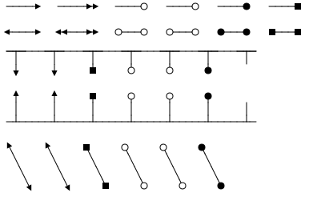
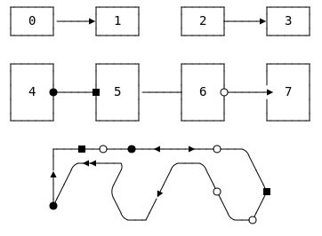
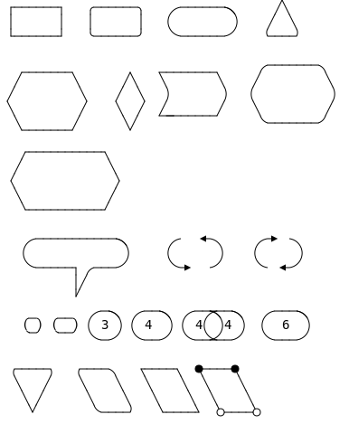
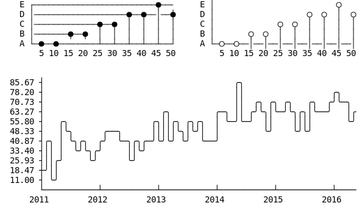

# elm-svgbob

Fork of the great ASCII to SVG converter SvgBob by Ivan Ceras.It converts an
ASCII-Art string into a "nicely rendered" svg image. The code below depicts
everything that is required. You can do a littlebit of customization by changing
the default settings. That is it ...

Try out the demo at: https://andre-dietrich.github.io/elm-svgbob/

And see the implementation at [`examples/Main.elm`](examples/Main.elm).

```elm
import SvgBob

view : Html msg
view =
    """
    +------+   +-----+   +-----+   +-----+
    |      |   |     |   |     |   |     |
    | Foo  +-->| Bar +---+ Baz |<--+ Moo |
    |      |   |     |   |     |   |     |
    +------+   +-----+   +--+--+   +-----+
                  A         |
                  |         V
    .-------------+-----------------------.
    | Hello here and there and everywhere |
    '-------------------------------------'
    """
    |> SvgBob.init SvgBob.default -- or use your own settings
    |> SvgBob.getSvg [ attribute "vector-effect" "non-scaling-stroke" ]

-- you cann pass your own settings
settings =
    { fontSize = 14.0
    , lineWidth = 1.0
    , textWidth = 8.0
    , textHeight = 16.0
    , arcRadius = 4.0
    , color = Color.rgb 0 0 0
    }
```

## How to Draw things ...

Since the usage of the API is pretty straight forward, the following section
give a brief overview, how things can be drawn with this library.

### Boxes

Depending on the type of characters, it is possible to define different kind of
boxes. Supported characters for

* borders:

  * straight: `-`, `_`, `|`
  * rounded: `(`, `)`
  * diagonal: `\`, `/`

* corners:

  * normal: `+`

  * rounded: all of them are actually treated equally, when creating the svg
    corner. Different representations do only affect the ASCII drawing.

    `.`, `,`, \`, `´`, `'`

  * special: filled dot `*`, filled square `#`, empty dot (`o`, `O`)

```
 +-----+      _____      +-----+      _____       _____
 |  0  |     |  1  |     |  2  |     |  3  |     |_ 4 _|
 +-----+     |_____|     |_____|     +-----+

 .-----.     ._____.     ,-----,     -------     `-----`
 |  5  |     |  6  |     |  7  |     |  8  |     |  9  |
 '-----'     ,_____,     |_____|     -------     `_____`

 o------o    *------*    #------#    O------O    .-----+
 |  10  |    |  11  |    |  12  |    |  13  |    |  14 |
 o------o    *------*    #------#    O------O    +-----'

  .----+     +----.      .-----.     /\       .------.
 (  15 |     | 16  )    (  17   )   /18\     /  19  /
  `----+     +----´      `-----´   /____\   /______/
```


### Arrows & Connectors

Depending on the direction of your arrow you have to use on either `<`, `>`,
`v`, `V`, `^`, `A`. The other endings (`*`, `#`, `o`, `O`) are direction
independent.

```
 ---->   ---->>   ----o   ----O   ----*   ----#

 <--->   <<-->>   o---o   O---O   *---*   #---#
 _______________________________________
  |     |     |     |     |     |     |
  v     V     #     o     O     *

  ^     A     #     o     O     *
  |     |     |     |     |     |     |
 -+-----+-----+-----+-----+-----+-----+-

 ^     A     #     o     O     *
  \     \     \     \     \     \
   \     \     \     \     \     \
    v     V     #     o     O     *
```



You can also use the arrows to connect, your other drawings, but keep in mind
that in some cases you will have to use the `+` sign to fully attach your lines
to another edge.


```
 +-----+     +-----+     +-----+     +-----+
 |  0  |---->|  1  |     |  2  +---->|  3  |
 +-----+     +-----+     +-----+     +-----+

 +-----+     +-----+     +-----+     +-----+
 |     |     |     |     |     |     |     |
 |  4  *-----#  5  |-----+  6  o----->  7  |
 |     |     |     |     |     |     |     |
 +-----+     +-----+     +-----+     +-----+

       +---#--o---*---<--->---O---.
       |  .-<<---,      .---.      \
       A /      /      /     \      \
       |/      (      V       o      #
       *        \    /         \    /
                 `--+           `--O
```



### More Shapes

You can draw even more complex shapes as depicted below. If you want use this
system for more complex drawings, try out the following websites, that can be
used as online ASCII-Art drawing tools:

* A pretty good online drawing tool:

  http://asciiflow.com

* The orignal svgbob implementation, this library is mostly compatible to it,
  but svgbob offers more sophisticated circles, lines, and color:

  https://ivanceras.github.io/svgbob-editor/


```
 +------+   .------.    .------.      /\
 |      |   |      |   (        )    /  \
 +------+   '------'    '------'    '----'

   _______            ________      .-------.
  /       \      /\   \       \    /         \
 /         \    /  \   )       )  (           )
 \         /    \  /  /_______/    \         /
  \_______/      \/                 '-------'

   +----------+
  /            \
 +              +
  \            /
   +----------+

    .-----------.       .   <.      .>  .
   (             )     (      )    (     )
    '-----+ ,---'       `>   '      `  <'
          |/
          '
    _   __   .-.   .--.   .--.--.    .---.
   (_) (__) ( 3 ) ( 4  ) ( 4( )4 )  (  6  )
             '-'   `--'   `--'--'    `---´

 .-----.  .----.   +----+  *----*
  \   /    \    \   \    \  \    \
   \ /      \    \   \    \  \    \
    '        '----'   +----+  O----O
```



## Box Drawing

The Unicode standard defines a set of characters/symbols, that were used in the
past for drawing user interfaces and menues within the console. You can use
these symbols too, or in combination with the upper symbols an shapes.

```
╔════════════════════════════════════[×]═╗       ╭─────╮
║ Fenstertitel                           ║       │     │     ╳
╟──────────────────────────────────────┬─╢       ╵     ╷    ╱ ╲
║ Fensterinhalt                        │▲║       ╰─────╯
║                                      │░║
║                                      │░║       ┌─┬┐  ╔═╦╗  ╓─╥╖  ╒═╤╕
║                                      │░║       │ ││  ║ ║║  ║ ║║  │ ││
║                                      │░║       ├─┼┤  ╠═╬╣  ╟─╫╢  ╞═╪╡
║                                      │█║       └─┴┘  ╚═╩╝  ╙─╨╜  ╘═╧╛
║                                      │░║
║                                      │░║       ┌───────────────────┐
║                                      │░║       │  ╔═══╗ Some Text  │▒
║                                      │░║       │  ╚═╦═╝ in the box │▒
║                                      │░║       ╞═╤══╩══╤═══════════╡▒
║                                      │░║       │ ├──┬──┤           │▒
║                                      │░║       │ └──┴──┘           │▒
║                                      │▼║       └───────────────────┘▒
╚══════════════════════════════════════╧═╝        ▒▒▒▒▒▒▒▒▒▒▒▒▒▒▒▒▒▒▒▒▒
```


**Box Drawing**

The following table contains a set of characters, that can be used via copy and
paste to draw any kind of boxes.

|        |  0  |  1  |  2  |  3  |  4  |  5  |  6  |  7  |  8  |  9  |  A  |  B  |  C  |  D  |  E  |  F  |
| ------ |:---:|:---:|:---:|:---:|:---:|:---:|:---:|:---:|:---:|:---:|:---:|:---:|:---:|:---:|:---:|:---:|
| U+250x |  ─  |  ━  |  │  |  ┃  |  ┄  |  ┅  |  ┆  |  ┇  |  ┈  |  ┉  |  ┊  |  ┋  |  ┌  |  ┍  |  ┎  |  ┏  |
| U+251x |  ┐  |  ┑  |  ┒  |  ┓  |  └  |  ┕  |  ┖  |  ┗  |  ┘  |  ┙  |  ┚  |  ┛  |  ├  |  ┝  |  ┞  |  ┟  |
| U+252x |  ┠  |  ┡  |  ┢  |  ┣  |  ┤  |  ┥  |  ┦  |  ┧  |  ┨  |  ┩  |  ┪  |  ┫  |  ┬  |  ┭  |  ┮  |  ┯  |
| U+253x |  ┰  |  ┱  |  ┲  |  ┳  |  ┴  |  ┵  |  ┶  |  ┷  |  ┸  |  ┹  |  ┺  |  ┻  |  ┼  |  ┽  |  ┾  |  ┿  |
| U+254x |  ╀  |  ╁  |  ╂  |  ╃  |  ╄  |  ╅  |  ╆  |  ╇  |  ╈  |  ╉  |  ╊  |  ╋  |  ╌  |  ╍  |  ╎  |  ╏  |
| U+255x |  ═  |  ║  |  ╒  |  ╓  |  ╔  |  ╕  |  ╖  |  ╗  |  ╘  |  ╙  |  ╚  |  ╛  |  ╜  |  ╝  |  ╞  |  ╟  |
| U+256x |  ╠  |  ╡  |  ╢  |  ╣  |  ╤  |  ╥  |  ╦  |  ╧  |  ╨  |  ╩  |  ╪  |  ╫  |  ╬  |  ╭  |  ╮  |  ╯  |
| U+257x |  ╰  |  ╱  |  ╲  |  ╳  |  ╴  |  ╵  |  ╶  |  ╷  |  ╸  |  ╹  |  ╺  |  ╻  |  ╼  |  ╽  |  ╾  |  ╿  |


**Block Elements** https://en.wikipedia.org/wiki/Block_Elements

If you need shadows or different kind of shadings, you can use some of the
following elements.

|        |  0  |  1  |  2  |  3  |  4  |  5  |  6  |  7  |  8  |  9  |  A  |  B  |  C  |  D  |  E  |  F  |
| ------ |:---:|:---:|:---:|:---:|:---:|:---:|:---:|:---:|:---:|:---:|:---:|:---:|:---:|:---:|:---:|:---:|
| U+258x |  ▀  |  ▁  |  ▂  |  ▃  |  ▄  |  ▅  |  ▆  |  ▇  |  █  |  ▉  |  ▊  |  ▋  |  ▌  |  ▍  |  ▎  |  ▏  |
| U+259x |  ▐  |  ░  |  ▒  |  ▓  |  ▔  |  ▕  |  ▖  |  ▗  |  ▘  |  ▙  |  ▚  |  ▛  |  ▜  |  ▝  |  ▞  |  ▟  |

**Geometric Shapes** https://en.wikipedia.org/wiki/Geometric_Shapes

|        | 0   | 1   | 2   | 3   | 4   | 5   | 6   | 7   | 8   | 9   | A   | B   | C   | D   | E   | F   |
| ------ |:---:|:---:|:---:|:---:|:---:|:---:|:---:|:---:|:---:|:---:|:---:|:---:|:---:|:---:|:---:|:---:|
| U+25Ax | ■   | □   | ▢   | ▣   | ▤   | ▥   | ▦   | ▧   | ▨   | ▩   | ▪   | ▫   | ▬   | ▭   | ▮   | ▯   |
| U+25Bx | ▰   | ▱   | ▲   | △   | ▴   | ▵   | ▶   | ▷   | ▸   | ▹   | ►   | ▻   | ▼   | ▽   | ▾   | ▿   |
| U+25Cx | ◀   | ◁   | ◂   | ◃   | ◄   | ◅   | ◆   | ◇   | ◈   | ◉   | ◊   | ○   | ◌   | ◍   | ◎   | ●   |
| U+25Dx | ◐   | ◑   | ◒   | ◓   | ◔   | ◕   | ◖   | ◗   | ◘   | ◙   | ◚   | ◛   | ◜   | ◝   | ◞   | ◟   |
| U+25Ex | ◠   | ◡   | ◢   | ◣   | ◤   | ◥   | ◦   | ◧   | ◨   | ◩   | ◪   | ◫   | ◬   | ◭   | ◮   | ◯   |
| U+25Fx | ◰   | ◱   | ◲   | ◳   | ◴   | ◵   | ◶   | ◷   | ◸   | ◹   | ◺   | ◻   | ◼   | ◽  | ◾  | ◿   |


**Misc:** https://en.wikipedia.org/wiki/Miscellaneous_Symbols_and_Arrows


|        | 0   | 1   | 2   | 3   | 4   | 5   | 6   | 7   | 8   | 9   | A   | B   | C   | D   | E   | F   |
| ------ |:---:|:---:|:---:|:---:|:---:|:---:|:---:|:---:|:---:|:---:|:---:|:---:|:---:|:---:|:---:|:---:|
| U+2B0x | ⬀   | ⬁   | ⬂   | ⬃   | ⬄   | ⬅   | ⬆   | ⬇   | ⬈   | ⬉   | ⬊   | ⬋   | ⬌   | ⬍   | ⬎   | ⬏   |
| U+2B1x | ⬐   | ⬑   | ⬒   | ⬓   | ⬔   | ⬕   | ⬖   | ⬗   | ⬘   | ⬙   | ⬚   | ⬛  | ⬜  | ⬝   | ⬞   | ⬟   |
| U+2B2x | ⬠   | ⬡   | ⬢   | ⬣   | ⬤   | ⬥   | ⬦   | ⬧   | ⬨   | ⬩   | ⬪   | ⬫   | ⬬   | ⬭   | ⬮   | ⬯   |
| U+2B3x | ⬰   | ⬱   |    | ⬳   |    |    |    |    |    |    |    |    |    |    |    | ⬿   |
| U+2B4x |    |    |    |    |    |    |    |    |    |    |    |    |    |    |    |    |
| U+2B5x | ⭐  | ⭑   | ⭒   | ⭓   | ⭔   | ⭕  |    |    | ⭘   |    |    |    |    |    |    |    |
| U+2B6x | ⭠   | ⭡   | ⭢   | ⭣   | ⭤   |    |    |    |    |    |    |    |    |    |    |    |
| U+2B8x | ⮀   | ⮁   | ⮂   | ⮃   |     |     |     |     |     |     |     |     |     |     |     |     |
| U+2B9x |     |     |     |     |     | ⮕   |     |     |     |     |     |     |     |     |     |     |


## Emojis

Since nowadays also Emojis are part of the unicode standard, you can directly
integrate any of your unicode emojis to your picture.

```
   😎             👩

  Bob            Alice
   |    hello      |
   +-------------->|
   |               |
   |  Is it ok?    |
   |<- - - - - - - |
  Bob            Alice

   😎             👩
```


The table below, contain some of the most widely used emojis:

|         |  0  |  1  |  2  |  3  |  4  |  5  |  6  |  7  |  8  |  9  |  A  |  B  |  C  |  D  |  E  |  F  |
| ------- |:---:|:---:|:---:|:---:|:---:|:---:|:---:|:---:|:---:|:---:|:---:|:---:|:---:|:---:|:---:|:---:|
| U+1F60x | 😀  | 😁  | 😂  | 😃  | 😄  | 😅  | 😆  | 😇  | 😈  | 😉  | 😊  | 😋  | 😌  | 😍  | 😎  | 😏  |
| U+1F61x | 😐  | 😑  | 😒  | 😓  | 😔  | 😕  | 😖  | 😗  | 😘  | 😙  | 😚  | 😛  | 😜  | 😝  | 😞  | 😟  |
| U+1F62x | 😠  | 😡  | 😢  | 😣  | 😤  | 😥  | 😦  | 😧  | 😨  | 😩  | 😪  | 😫  | 😬  | 😭  | 😮  | 😯  |
| U+1F63x | 😰  | 😱  | 😲  | 😳  | 😴  | 😵  | 😶  | 😷  | 😸  | 😹  | 😺  | 😻  | 😼  | 😽  | 😾  | 😿  |
| U+1F64x | 🙀  | 🙁  | 🙂  | 🙃  | 🙄  | 🙅  | 🙆  | 🙇  | 🙈  | 🙉  | 🙊  | 🙋  | 🙌  | 🙍  | 🙎  | 🙏  |


### List 1

|         |  0  |  1  |  2  |  3  |  4  |  5  |  6  |  7  |  8  |  9  |  A  |  B  |  C  |  D  |  E  |  F  |
| ------- |:---:|:---:|:---:|:---:|:---:|:---:|:---:|:---:|:---:|:---:|:---:|:---:|:---:|:---:|:---:|:---:|
| U+1F4Dx | 📐  | 📑  | 📒  | 📓  | 📔  | 📕  | 📖  | 📗  | 📘  | 📙  | 📚  | 📛  | 📜  | 📝  | 📞  | 📟  |
| U+1F4Ex | 📠  | 📡  | 📢  | 📣  | 📤  | 📥  | 📦  | 📧  | 📨  | 📩  | 📪  | 📫  | 📬  | 📭  | 📮  | 📯  |
| U+1F4Fx | 📰  | 📱  | 📲  | 📳  | 📴  | 📵  | 📶  | 📷  | 📸  | 📹  | 📺  | 📻  | 📼  | 📽️  |     | 📿  |
| U+1F50x | 🔀  | 🔁  | 🔂  | 🔃  | 🔄  | 🔅  | 🔆  | 🔇  | 🔈  | 🔉  | 🔊  | 🔋  | 🔌  | 🔍  | 🔎  | 🔏  |
| U+1F51x | 🔐  | 🔑  | 🔒  | 🔓  | 🔔  | 🔕  | 🔖  | 🔗  | 🔘  | 🔙  | 🔚  | 🔛  | 🔜  | 🔝  | 🔞  | 🔟  |
| U+1F52x | 🔠  | 🔡  | 🔢  | 🔣  | 🔤  | 🔥  | 🔦  | 🔧  | 🔨  | 🔩  | 🔪  | 🔫  | 🔬  | 🔭  | 🔮  | 🔯  |
| U+1F53x | 🔰  | 🔱  | 🔲  | 🔳  | 🔴  | 🔵  | 🔶  | 🔷  | 🔸  | 🔹  | 🔺  | 🔻  | 🔼  | 🔽  |     |     |
| U+1F54x |     |     |     |     |     |     |     |     |     | 🕉️  | 🕊️  | 🕋  | 🕌  | 🕍  | 🕎  |     |
| U+1F55x | 🕐  | 🕑  | 🕒  | 🕓  | 🕔  | 🕕  | 🕖  | 🕗  | 🕘  | 🕙  | 🕚  | 🕛  | 🕜  | 🕝  | 🕞  | 🕟  |
| U+1F56x | 🕠  | 🕡  | 🕢  | 🕣  | 🕤  | 🕥  | 🕦  | 🕧  |     |     |     |     |     |     |     | 🕯️  |
| U+1F57x | 🕰️  |     |     | 🕳️  | 🕴️  | 🕵️  | 🕶️  | 🕷️  | 🕸️  | 🕹️  | 🕺  |     |     |     |     |     |
| U+1F58x |     |     |     |     |     |     |     | 🖇️  |     |     | 🖊️  | 🖋️  | 🖌️  | 🖍️  |     |     |
| U+1F59x | 🖐️  |     |     |     |     | 🖕  | 🖖  |     |     |     |     |     |     |     |     |     |
| U+1F5Ax |     |     |     |     | 🖤  | 🖥️  |     |     | 🖨️  |     |     |     |     |     |     |     |
| U+1F5Bx |     | 🖱️  | 🖲️  |     |     |     |     |     |     |     |     |     | 🖼️  |     |     |     |
| U+1F5Cx |     |     | 🗂️  | 🗃️  | 🗄️  |     |     |     |     |     |     |     |     |     |     |     |
| U+1F5Dx |     | 🗑️  | 🗒️  | 🗓️  |     |     |     |     |     |     |     |     | 🗜️  | 🗝️  | 🗞️  |     |
| U+1F5Ex |     | 🗡️  |     | 🗣️  |     |     |     |     | 🗨️  |     |     |     |     |     |     | 🗯️  |
| U+1F5Fx |     |     |     | 🗳️  |     |     |     |     |     |     | 🗺️  | 🗻  | 🗼  | 🗽  | 🗾  | 🗿  |
| U+1F60x | 😀  | 😁  | 😂  | 😃  | 😄  | 😅  | 😆  | 😇  | 😈  | 😉  | 😊  | 😋  | 😌  | 😍  | 😎  | 😏  |
| U+1F61x | 😐  | 😑  | 😒  | 😓  | 😔  | 😕  | 😖  | 😗  | 😘  | 😙  | 😚  | 😛  | 😜  | 😝  | 😞  | 😟  |
| U+1F62x | 😠  | 😡  | 😢  | 😣  | 😤  | 😥  | 😦  | 😧  | 😨  | 😩  | 😪  | 😫  | 😬  | 😭  | 😮  | 😯  |
| U+1F63x | 😰  | 😱  | 😲  | 😳  | 😴  | 😵  | 😶  | 😷  | 😸  | 😹  | 😺  | 😻  | 😼  | 😽  | 😾  | 😿  |
| U+1F64x | 🙀  | 🙁  | 🙂  | 🙃  | 🙄  | 🙅  | 🙆  | 🙇  | 🙈  | 🙉  | 🙊  | 🙋  | 🙌  | 🙍  | 🙎  | 🙏  |
| U+1F68x | 🚀  | 🚁  | 🚂  | 🚃  | 🚄  | 🚅  | 🚆  | 🚇  | 🚈  | 🚉  | 🚊  | 🚋  | 🚌  | 🚍  | 🚎  | 🚏  |
| U+1F69x | 🚐  | 🚑  | 🚒  | 🚓  | 🚔  | 🚕  | 🚖  | 🚗  | 🚘  | 🚙  | 🚚  | 🚛  | 🚜  | 🚝  | 🚞  | 🚟  |
| U+1F6Ax | 🚠  | 🚡  | 🚢  | 🚣  | 🚤  | 🚥  | 🚦  | 🚧  | 🚨  | 🚩  | 🚪  | 🚫  | 🚬  | 🚭  | 🚮  | 🚯  |
| U+1F6Bx | 🚰  | 🚱  | 🚲  | 🚳  | 🚴  | 🚵  | 🚶  | 🚷  | 🚸  | 🚹  | 🚺  | 🚻  | 🚼  | 🚽  | 🚾  | 🚿  |
| U+1F6Cx | 🛀  | 🛁  | 🛂  | 🛃  | 🛄  | 🛅  |     |     |     |     |     | 🛋️  | 🛌  | 🛍️  | 🛎️  | 🛏️  |


### List 2

|         |  0  |  1  |  2  |  3  |  4  |  5  |  6  |  7  |  8  |  9  |  A  |  B  |  C  |  D  |  E  |  F  |
| ------- |:---:|:---:|:---:|:---:|:---:|:---:|:---:|:---:|:---:|:---:|:---:|:---:|:---:|:---:|:---:|:---:|
| U+1F6Dx | 🛐  | 🛑  | 🛒  |     |     | 🛕  |  🛖  |  🛗  |     |     |     |     |     |     |     |     |
| U+1F6Ex | 🛠️  | 🛡️  | 🛢️  | 🛣️  | 🛤️  | 🛥️  |     |     |     | 🛩️  |     | 🛫  | 🛬  |     |     |     |
| U+1F6Fx | 🛰️  |     |     | 🛳️  | 🛴  | 🛵  | 🛶  | 🛷  | 🛸  | 🛹  | 🛺  |  🛻  |  🛼  |     |     |     |
| U+1F7Ex | 🟠  | 🟡  | 🟢  | 🟣  | 🟤  | 🟥  | 🟦  | 🟧  | 🟨  | 🟩  | 🟪  | 🟫  |     |     |     |     |
| U+1F90x |     |     |     |     |     |     |     |     |     |     |     |     |  🤌  | 🤍  | 🤎  | 🤏  |
| U+1F91x | 🤐  | 🤑  | 🤒  | 🤓  | 🤔  | 🤕  | 🤖  | 🤗  | 🤘  | 🤙  | 🤚  | 🤛  | 🤜  | 🤝  | 🤞  | 🤟  |
| U+1F92x | 🤠  | 🤡  | 🤢  | 🤣  | 🤤  | 🤥  | 🤦  | 🤧  | 🤨  | 🤩  | 🤪  | 🤫  | 🤬  | 🤭  | 🤮  | 🤯  |
| U+1F93x | 🤰  | 🤱  | 🤲  | 🤳  | 🤴  | 🤵  | 🤶  | 🤷  | 🤸  | 🤹  | 🤺  |     | 🤼  | 🤽  | 🤾  | 🤿  |
| U+1F94x | 🥀  | 🥁  | 🥂  | 🥃  | 🥄  | 🥅  |     | 🥇  | 🥈  | 🥉  | 🥊  | 🥋  | 🥌  | 🥍  | 🥎  | 🥏  |
| U+1F95x | 🥐  | 🥑  | 🥒  | 🥓  | 🥔  | 🥕  | 🥖  | 🥗  | 🥘  | 🥙  | 🥚  | 🥛  | 🥜  | 🥝  | 🥞  | 🥟  |
| U+1F96x | 🥠  | 🥡  | 🥢  | 🥣  | 🥤  | 🥥  | 🥦  | 🥧  | 🥨  | 🥩  | 🥪  | 🥫  | 🥬  | 🥭  | 🥮  | 🥯  |
| U+1F97x | 🥰  | 🥱  |  🥲  | 🥳  | 🥴  | 🥵  | 🥶  |     |     |     | 🥺  | 🥻  | 🥼  | 🥽  | 🥾  | 🥿  |
| U+1F98x | 🦀  | 🦁  | 🦂  | 🦃  | 🦄  | 🦅  | 🦆  | 🦇  | 🦈  | 🦉  | 🦊  | 🦋  | 🦌  | 🦍  | 🦎  | 🦏  |
| U+1F99x | 🦐  | 🦑  | 🦒  | 🦓  | 🦔  | 🦕  | 🦖  | 🦗  | 🦘  | 🦙  | 🦚  | 🦛  | 🦜  | 🦝  | 🦞  | 🦟  |
| U+1F9Ax | 🦠  | 🦡  | 🦢  |     |     | 🦥  | 🦦  | 🦧  | 🦨  | 🦩  | 🦪  |     |     |     | 🦮  | 🦯  |
| U+1F9Bx | 🦰  | 🦱  | 🦲  | 🦳  | 🦴  | 🦵  | 🦶  | 🦷  | 🦸  | 🦹  | 🦺  | 🦻  | 🦼  | 🦽  | 🦾  | 🦿  |
| U+1F9Cx | 🧀  | 🧁  | 🧂  | 🧃  | 🧄  | 🧅  | 🧆  | 🧇  | 🧈  | 🧉  | 🧊  |  🧋  |     | 🧍  | 🧎  | 🧏  |
| U+1F9Dx | 🧐  | 🧑  | 🧒  | 🧓  | 🧔  | 🧕  | 🧖  | 🧗  | 🧘  | 🧙  | 🧚  | 🧛  | 🧜  | 🧝  | 🧞  | 🧟  |
| U+1F9Ex | 🧠  | 🧡  | 🧢  | 🧣  | 🧤  | 🧥  | 🧦  | 🧧  | 🧨  | 🧩  | 🧪  | 🧫  | 🧬  | 🧭  | 🧮  | 🧯  |
| U+1F9Fx | 🧰  | 🧱  | 🧲  | 🧳  | 🧴  | 🧵  | 🧶  | 🧷  | 🧸  | 🧹  | 🧺  | 🧻  | 🧼  | 🧽  | 🧾  | 🧿  |
| U+1FA7x | 🩰  | 🩱  | 🩲  | 🩳  |     |     |     |     | 🩸  | 🩹  | 🩺  |     |     |     |     |     |
| U+1FA8x | 🪀  | 🪁  | 🪂  |     |     |     |     |     |     |     |     |     |     |     |     |     |
| U+1FA9x | 🪐  | 🪑  | 🪒  | 🪓  | 🪔  | 🪕  |     |     |     |     |     |     |     |     |     |     |


### List 3

|         |  0  |  1  |  2  |  3  |  4  |  5  |  6  |  7  |  8  |  9  |  A  |  B  |  C  |  D  |  E  |  F  |
| ------- |:---:|:---:|:---:|:---:|:---:|:---:|:---:|:---:|:---:|:---:|:---:|:---:|:---:|:---:|:---:|:---:|
| U+1F30x | 🌀  | 🌁  | 🌂  | 🌃  | 🌄  | 🌅  | 🌆  | 🌇  | 🌈  | 🌉  | 🌊  | 🌋  | 🌌  | 🌍  | 🌎  | 🌏  |
| U+1F31x | 🌐  | 🌑  | 🌒  | 🌓  | 🌔  | 🌕  | 🌖  | 🌗  | 🌘  | 🌙  | 🌚  | 🌛  | 🌜  | 🌝  | 🌞  | 🌟  |
| U+1F32x | 🌠  | 🌡️  |     |     | 🌤️  | 🌥️  | 🌦️  | 🌧️  | 🌨️  | 🌩️  | 🌪️  | 🌫️  | 🌬️  | 🌭  | 🌮  | 🌯  |
| U+1F33x | 🌰  | 🌱  | 🌲  | 🌳  | 🌴  | 🌵  | 🌶️  | 🌷  | 🌸  | 🌹  | 🌺  | 🌻  | 🌼  | 🌽  | 🌾  | 🌿  |
| U+1F34x | 🍀  | 🍁  | 🍂  | 🍃  | 🍄  | 🍅  | 🍆  | 🍇  | 🍈  | 🍉  | 🍊  | 🍋  | 🍌  | 🍍  | 🍎  | 🍏  |
| U+1F35x | 🍐  | 🍑  | 🍒  | 🍓  | 🍔  | 🍕  | 🍖  | 🍗  | 🍘  | 🍙  | 🍚  | 🍛  | 🍜  | 🍝  | 🍞  | 🍟  |
| U+1F36x | 🍠  | 🍡  | 🍢  | 🍣  | 🍤  | 🍥  | 🍦  | 🍧  | 🍨  | 🍩  | 🍪  | 🍫  | 🍬  | 🍭  | 🍮  | 🍯  |
| U+1F37x | 🍰  | 🍱  | 🍲  | 🍳  | 🍴  | 🍵  | 🍶  | 🍷  | 🍸  | 🍹  | 🍺  | 🍻  | 🍼  | 🍽️  | 🍾  | 🍿  |
| U+1F38x | 🎀  | 🎁  | 🎂  | 🎃  | 🎄  | 🎅  | 🎆  | 🎇  | 🎈  | 🎉  | 🎊  | 🎋  | 🎌  | 🎍  | 🎎  | 🎏  |
| U+1F39x | 🎐  | 🎑  | 🎒  | 🎓  |     |     | 🎖️  | 🎗️  |     | 🎙️  | 🎚️  | 🎛️  |     |     | 🎞️  | 🎟️  |
| U+1F3Ax | 🎠  | 🎡  | 🎢  | 🎣  | 🎤  | 🎥  | 🎦  | 🎧  | 🎨  | 🎩  | 🎪  | 🎫  | 🎬  | 🎭  | 🎮  | 🎯  |
| U+1F3Bx | 🎰  | 🎱  | 🎲  | 🎳  | 🎴  | 🎵  | 🎶  | 🎷  | 🎸  | 🎹  | 🎺  | 🎻  | 🎼  | 🎽  | 🎾  | 🎿  |
| U+1F3Cx | 🏀  | 🏁  | 🏂  | 🏃  | 🏄  | 🏅  | 🏆  | 🏇  | 🏈  | 🏉  | 🏊  | 🏋️  | 🏌️  | 🏍️  | 🏎️  | 🏏  |
| U+1F3Dx | 🏐  | 🏑  | 🏒  | 🏓  | 🏔️  | 🏕️  | 🏖️  | 🏗️  | 🏘️  | 🏙️  | 🏚️  | 🏛️  | 🏜️  | 🏝️  | 🏞️  | 🏟️  |
| U+1F3Ex | 🏠  | 🏡  | 🏢  | 🏣  | 🏤  | 🏥  | 🏦  | 🏧  | 🏨  | 🏩  | 🏪  | 🏫  | 🏬  | 🏭  | 🏮  | 🏯  |
| U+1F3Fx | 🏰  |     |     | 🏳️  | 🏴  | 🏵️  |     | 🏷️  | 🏸  | 🏹  | 🏺  | 🏻  | 🏼  | 🏽  | 🏾  | 🏿  |
| U+1F40x | 🐀  | 🐁  | 🐂  | 🐃  | 🐄  | 🐅  | 🐆  | 🐇  | 🐈  | 🐉  | 🐊  | 🐋  | 🐌  | 🐍  | 🐎  | 🐏  |
| U+1F41x | 🐐  | 🐑  | 🐒  | 🐓  | 🐔  | 🐕  | 🐖  | 🐗  | 🐘  | 🐙  | 🐚  | 🐛  | 🐜  | 🐝  | 🐞  | 🐟  |
| U+1F42x | 🐠  | 🐡  | 🐢  | 🐣  | 🐤  | 🐥  | 🐦  | 🐧  | 🐨  | 🐩  | 🐪  | 🐫  | 🐬  | 🐭  | 🐮  | 🐯  |
| U+1F43x | 🐰  | 🐱  | 🐲  | 🐳  | 🐴  | 🐵  | 🐶  | 🐷  | 🐸  | 🐹  | 🐺  | 🐻  | 🐼  | 🐽  | 🐾  | 🐿️  |
| U+1F44x | 👀  | 👁️  | 👂  | 👃  | 👄  | 👅  | 👆  | 👇  | 👈  | 👉  | 👊  | 👋  | 👌  | 👍  | 👎  | 👏  |
| U+1F45x | 👐  | 👑  | 👒  | 👓  | 👔  | 👕  | 👖  | 👗  | 👘  | 👙  | 👚  | 👛  | 👜  | 👝  | 👞  | 👟  |
| U+1F46x | 👠  | 👡  | 👢  | 👣  | 👤  | 👥  | 👦  | 👧  | 👨  | 👩  | 👪  | 👫  | 👬  | 👭  | 👮  | 👯  |
| U+1F47x | 👰  | 👱  | 👲  | 👳  | 👴  | 👵  | 👶  | 👷  | 👸  | 👹  | 👺  | 👻  | 👼  | 👽  | 👾  | 👿  |
| U+1F48x | 💀  | 💁  | 💂  | 💃  | 💄  | 💅  | 💆  | 💇  | 💈  | 💉  | 💊  | 💋  | 💌  | 💍  | 💎  | 💏  |
| U+1F4Ax | 💠  | 💡  | 💢  | 💣  | 💤  | 💥  | 💦  | 💧  | 💨  | 💩  | 💪  | 💫  | 💬  | 💭  | 💮  | 💯  |
| U+1F4Bx | 💰  | 💱  | 💲  | 💳  | 💴  | 💵  | 💶  | 💷  | 💸  | 💹  | 💺  | 💻  | 💼  | 💽  | 💾  | 💿  |
| U+1F49x | 💐  | 💑  | 💒  | 💓  | 💔  | 💕  | 💖  | 💗  | 💘  | 💙  | 💚  | 💛  | 💜  | 💝  | 💞  | 💟  |
| U+1F4Cx | 📀  | 📁  | 📂  | 📃  | 📄  | 📅  | 📆  | 📇  | 📈  | 📉  | 📊  | 📋  | 📌  | 📍  | 📎  | 📏  |


### List 4


|         |  0  |  1  |  2  |  3  |  4  |  5  |  6  |  7  |  8  |  9  |  A  |  B  |  C  |  D  |  E  |  F  |
| ------- |:---:|:---:|:---:|:---:|:---:|:---:|:---:|:---:|:---:|:---:|:---:|:---:|:---:|:---:|:---:|:---:|
| U+26Dx  |     | ⛑️  |     | ⛓️  | ⛔️ |     |     |     |     |     |     |     |     |     |     |     |
| U+26Ex  |     |     |     |     |     |     |     |     |     | ⛩️  | ⛪️ |     |     |     |     |     |
| U+26Fx  | ⛰️  | ⛱️  | ⛲️ | ⛳️ | ⛴️  | ⛵️ |     | ⛷️  | ⛸️  | ⛹️  | ⛺️ |     |     | ⛽️ |     |     |
| U+270x  |     |     | ✂️  |     |     | ✅️ |     |     | ✈️  | ✉️  | ✊️ | ✋️ | ✌️  | ✍️  |     | ✏️  |
| U+271x  |     |     | ✒️  |     | ✔️  |     | ✖️  |     |     |     |     |     |     | ✝️  |     |     |
| U+272x  |     | ✡️  |     |     |     |     |     |     | ✨️ |     |     |     |     |     |     |     |
| U+273x  |     |     |     | ✳️  | ✴️  |     |     |     |     |     |     |     |     |     |     |     |
| U+274x  |     |     |     |     | ❄️  |     |     | ❇️  |     |     |     |     | ❌️ |     | ❎️ |     |
| U+275x  |     |     |     | ❓️ | ❔️ | ❕️ |     | ❗️ |     |     |     |     |     |     |     |     |
| U+276x  |     |     |     | ❣️  | ❤️  |     |     |     |     |     |     |     |     |     |     |     |
| U+279x  |     |     |     |     |     | ➕️ | ➖️ | ➗️ |     |     |     |     |     |     |     |     |
| U+27Ax  |     | ➡️  |     |     |     |     |     |     |     |     |     |     |     |     |     |     |
| U+27Bx  | ➰️ |     |     |     |     |     |     |     |     |     |     |     |     |     |     | ➿️ |
| U+293x  |     |     |     |     | ⤴️  | ⤵️  |     |     |     |     |     |     |     |     |     |     |
| U+2B0x  |     |     |     |     |     | ⬅️  | ⬆️  | ⬇️  |     |     |     |     |     |     |     |     |
| U+2B1x  |     |     |     |     |     |     |     |     |     |     |     | ⬛️ | ⬜️ |     |     |     |
| U+2B5x  | ⭐️ |     |     |     |     | ⭕️ |     |     |     |     |     |     |     |     |     |     |
| U+303x  | 〰️ |     |     |     |     |     |     |     |     |     |     |     |     | 〽️ |     |     |
| U+329x  |     |     |     |     |     |     |     | ㊗️ |     | ㊙️ |     |     |     |     |     |     |
| U+1F00x |     |     |     |     | 🀄  |     |     |     |     |     |     |     |     |     |     |     |
| U+1F0Cx |     |     |     |     |     |     |     |     |     |     |     |     |     |     |     | 🃏  |
| U+1F17x | 🅰️  | 🅱️  |     |     |     |     |     |     |     |     |     |     |     |     | 🅾️  | 🅿️  |
| U+1F18x |     |     |     |     |     |     |     |     |     |     |     |     |     |     | 🆎  |     |
| U+1F19x |     | 🆑  | 🆒  | 🆓  | 🆔  | 🆕  | 🆖  | 🆗  | 🆘  | 🆙  | 🆚  |     |     |     |     |     |
| U+1F20x |     | 🈁  | 🈂️ |     |     |     |     |     |     |     |     |     |     |     |     |     |
| U+1F21x |     |     |     |     |     |     |     |     |     |     | 🈚  |     |     |     |     |     |
| U+1F22x |     |     |     |     |     |     |     |     |     |     |     |     |     |     |     | 🈯  |
| U+1F23x |     |     | 🈲  | 🈳  | 🈴  | 🈵  | 🈶  | 🈷️ | 🈸  | 🈹  | 🈺  |     |     |     |     |     |
| U+1F25x | 🉐  | 🉑  |     |     |     |     |     |     |     |     |     |     |     |     |     |     |


### List 5


|        |  0  |  1  |  2  |  3  |  4  |  5  |  6  |  7  |  8  |  9  |  A  |  B  |  C  |  D  |  E  |  F  |
| ------ |:---:|:---:|:---:|:---:|:---:|:---:|:---:|:---:|:---:|:---:|:---:|:---:|:---:|:---:|:---:|:---:|
| U+00Ax |     |     |     |     |     |     |     |     |     | ©️  |     |     |     |     | ®️  |     |
| U+203x |     |     |     |     |     |     |     |     |     |     |     |     | ‼️  |     |     |     |
| U+204x |     |     |     |     |     |     |     |     |     | ⁉️  |     |     |     |     |     |     |
| U+212x |     |     | ™️  |     |     |     |     |     |     |     |     |     |     |     |     |     |
| U+213x |     |     |     |     |     |     |     |     |     | ℹ️  |     |     |     |     |     |     |
| U+219x |     |     |     |     | ↔️  | ↕️  | ↖️  | ↗️  | ↘️  | ↙️  |     |     |     |     |     |     |
| U+21Ax |     |     |     |     |     |     |     |     |     | ↩️  | ↪️  |     |     |     |     |     |
| U+231x |     |     |     |     |     |     |     |     |     |     | ⌚️ | ⌛️ |     |     |     |     |
| U+232x |     |     |     |     |     |     |     |     | ⌨️  |     |     |     |     |     |     |     |
| U+23Cx |     |     |     |     |     |     |     |     |     |     |     |     |     |     |     | ⏏️  |
| U+23Ex |     |     |     |     |     |     |     |     |     | ⏩️ | ⏪️ | ⏫️ | ⏬️ | ⏭️  | ⏮️  | ⏯️  |
| U+23Fx | ⏰️ | ⏱️  | ⏲️  | ⏳️ |     |     |     |     | ⏸️  | ⏹️  | ⏺️  |     |     |     |     |     |
| U+24Cx |     |     | Ⓜ️  |     |     |     |     |     |     |     |     |     |     |     |     |     |
| U+25Ax |     |     |     |     |     |     |     |     |     |     | ▪️  | ▫️  |     |     |     |     |
| U+25Bx |     |     |     |     |     |     | ▶️  |     |     |     |     |     |     |     |     |     |
| U+25Cx | ◀️  |     |     |     |     |     |     |     |     |     |     |     |     |     |     |     |
| U+25Fx |     |     |     |     |     |     |     |     |     |     |     | ◻️  | ◼️  | ◽️ | ◾️ |     |
| U+260x |  ☀  |  ☁  |  ☂  |  ☃  |  ☄  |  ★  |  ☆  |  ☇  |  ☈  |  ☉  |  ☊  |  ☋  |  ☌  |  ☍  |  ☎  |  ☏  |
| U+261x |  ☐  |  ☑  |  ☒  |  ☓  | ☔  | ☕  |  ☖  |  ☗  |  ☘  |  ☙  |  ☚  |  ☛  |  ☜  |  ☝  |  ☞  |  ☟  |
| U+262x |  ☠  |  ☡  |  ☢  |  ☣  |  ☤  |  ☥  |  ☦  |  ☧  |  ☨  |  ☩  |  ☪  |  ☫  |  ☬  |  ☭  |  ☮  |  ☯  |
| U+263x |  ☰  |  ☱  |  ☲  |  ☳  |  ☴  |  ☵  |  ☶  |  ☷  |  ☸  |  ☹  |  ☺  |  ☻  |  ☼  |  ☽  |  ☾  |  ☿  |
| U+264x |  ♀  |  ♁  |  ♂  |  ♃  |  ♄  |  ♅  |  ♆  |  ♇  | ♈  | ♉  | ♊  | ♋  | ♌  | ♍  | ♎  | ♏  |
| U+265x | ♐  | ♑  | ♒  | ♓  |  ♔  |  ♕  |  ♖  |  ♗  |  ♘  |  ♙  |  ♚  |  ♛  |  ♜  |  ♝  |  ♞  |  ♟  |
| U+266x |  ♠  |  ♡  |  ♢  |  ♣  |  ♤  |  ♥  |  ♦  |  ♧  |  ♨  |  ♩  |  ♪  |  ♫  |  ♬  |  ♭  |  ♮  |  ♯  |
| U+267x |  ♰  |  ♱  |  ♲  |  ♳  |  ♴  |  ♵  |  ♶  |  ♷  |  ♸  |  ♹  |  ♺  |  ♻  |  ♼  |  ♽  |  ♾  | ♿  |
| U+268x |  ⚀  |  ⚁  |  ⚂  |  ⚃  |  ⚄  |  ⚅  |  ⚆  |  ⚇  |  ⚈  |  ⚉  |  ⚊  |  ⚋  |  ⚌  |  ⚍  |  ⚎  |  ⚏  |
| U+269x |  ⚐  |  ⚑  |  ⚒  | ⚓  |  ⚔  |  ⚕  |  ⚖  |  ⚗  |  ⚘  |  ⚙  |  ⚚  |  ⚛  |  ⚜  |  ⚝  |  ⚞  |  ⚟  |
| U+26Ax |  ⚠  | ⚡  |  ⚢  |  ⚣  |  ⚤  |  ⚥  |  ⚦  |  ⚧  |  ⚨  |  ⚩  | ⚪  | ⚫  |  ⚬  |  ⚭  |  ⚮  |  ⚯  |
| U+26Bx |  ⚰  |  ⚱  |  ⚲  |  ⚳  |  ⚴  |  ⚵  |  ⚶  |  ⚷  |  ⚸  |  ⚹  |  ⚺  |  ⚻  |  ⚼  | ⚽  | ⚾  |     |
| U+26Cx |  ⛀  |  ⛁  |  ⛂  |  ⛃  | ⛄  | ⛅  |     |     |  ⛈  |     |     |     |     |     | ⛎  |  ⛏  |
| U+26Dx |     |  ⛑  |     |  ⛓  | ⛔  |     |     |     |     |     |     |     |     |     |     |     |
| U+26Ex |     |     |  ⛢  |     |     |     |     |     |     |  ⛩  | ⛪  |     |     |     |     |     |
| U+26Fx |  ⛰  |  ⛱  | ⛲  | ⛳  |  ⛴  | ⛵  |     |  ⛷  |  ⛸  |  ⛹  | ⛺  |  ⛻  |  ⛼  | ⛽  |     |     |


## Further Unicode Symbols

There are even many many more, please visit the following page to get an overview on all symbols, if you want ;-):

https://jrgraphix.net/r/Unicode/

🟠🟡🟢🟣🟤🟥🟦🟧🟨🟩🟪🟫


### Dingbats

https://en.wikipedia.org/wiki/Dingbat

|        |  0  |  1  |  2  |  3  |  4  |  5  |  6  |  7  |  8  |  9  |  A  |  B  |  C  |  D  |  E  |  F  |
| ------ |:---:|:---:|:---:|:---:|:---:|:---:|:---:|:---:|:---:|:---:|:---:|:---:|:---:|:---:|:---:|:---:|
| U+270x |  ✀  |  ✁  |  ✂  |  ✃  |  ✄  | ✅  |  ✆  |  ✇  |  ✈  |  ✉  | ✊  | ✋  |  ✌  |  ✍  |  ✎  |  ✏  |
| U+271x |  ✐  |  ✑  |  ✒  |  ✓  |  ✔  |  ✕  |  ✖  |  ✗  |  ✘  |  ✙  |  ✚  |  ✛  |  ✜  |  ✝  |  ✞  |  ✟  |
| U+272x |  ✠  |  ✡  |  ✢  |  ✣  |  ✤  |  ✥  |  ✦  |  ✧  | ✨  |  ✩  |  ✪  |  ✫  |  ✬  |  ✭  |  ✮  |  ✯  |
| U+273x |  ✰  |  ✱  |  ✲  |  ✳  |  ✴  |  ✵  |  ✶  |  ✷  |  ✸  |  ✹  |  ✺  |  ✻  |  ✼  |  ✽  |  ✾  |  ✿  |
| U+274x |  ❀  |  ❁  |  ❂  |  ❃  |  ❄  |  ❅  |  ❆  |  ❇  |  ❈  |  ❉  |  ❊  |  ❋  | ❌  |  ❍  | ❎  |  ❏  |
| U+275x |  ❐  |  ❑  |  ❒  | ❓  | ❔  | ❕  |  ❖  | ❗  |  ❘  |  ❙  |  ❚  |  ❛  |  ❜  |  ❝  |  ❞  |  ❟  |
| U+276x |  ❠  |  ❡  |  ❢  |  ❣  |  ❤  |  ❥  |  ❦  |  ❧  |  ❨  |  ❩  |  ❪  |  ❫  |  ❬  |  ❭  |  ❮  |  ❯  |
| U+277x |  ❰  |  ❱  |  ❲  |  ❳  |  ❴  |  ❵  |  ❶  |  ❷  |  ❸  |  ❹  |  ❺  |  ❻  |  ❼  |  ❽  |  ❾  |  ❿  |
| U+278x |  ➀  |  ➁  |  ➂  |  ➃  |  ➄  |  ➅  |  ➆  |  ➇  |  ➈  |  ➉  |  ➊  |  ➋  |  ➌  |  ➍  |  ➎  |  ➏  |
| U+279x |  ➐  |  ➑  |  ➒  |  ➓  |  ➔  | ➕  | ➖  | ➗  |  ➘  |  ➙  |  ➚  |  ➛  |  ➜  |  ➝  |  ➞  |  ➟  |
| U+27Ax |  ➠  |  ➡  |  ➢  |  ➣  |  ➤  |  ➥  |  ➦  |  ➧  |  ➨  |  ➩  |  ➪  |  ➫  |  ➬  |  ➭  |  ➮  |  ➯  |
| U+27Bx | ➰  |  ➱  |  ➲  |  ➳  |  ➴  |  ➵  |  ➶  |  ➷  |  ➸  |  ➹  |  ➺  |  ➻  |  ➼  |  ➽  |  ➾  | ➿  |


### Miscellaneous Technical

https://en.wikipedia.org/wiki/Miscellaneous_Technical

|        |  0  |  1  |  2  |  3  |  4  |  5  |  6  |  7  |  8  |  9  |  A  |  B  |  C  |  D  |  E  |  F  |
| ------ |:---:|:---:|:---:|:---:|:---:|:---:|:---:|:---:|:---:|:---:|:---:|:---:|:---:|:---:|:---:|:---:|
| U+230x |  ⌀  |  ⌁  |  ⌂  |  ⌃  |  ⌄  |  ⌅  |  ⌆  |  ⌇  |  ⌈  |  ⌉  |  ⌊  |  ⌋  |  ⌌  |  ⌍  |  ⌎  |  ⌏  |
| U+231x |  ⌐  |  ⌑  |  ⌒  |  ⌓  |  ⌔  |  ⌕  |  ⌖  |  ⌗  |  ⌘  |  ⌙  | ⌚  | ⌛  |  ⌜  |  ⌝  |  ⌞  |  ⌟  |
| U+232x |  ⌠  |  ⌡  |  ⌢  |  ⌣  |  ⌤  |  ⌥  |  ⌦  |  ⌧  |  ⌨  | 〈  | 〉  |  ⌫  |  ⌬  |  ⌭  |  ⌮  |  ⌯  |
| U+233x |  ⌰  |  ⌱  |  ⌲  |  ⌳  |  ⌴  |  ⌵  |  ⌶  |  ⌷  |  ⌸  |  ⌹  |  ⌺  |  ⌻  |  ⌼  |  ⌽  |  ⌾  |  ⌿  |
| U+234x |  ⍀  |  ⍁  |  ⍂  |  ⍃  |  ⍄  |  ⍅  |  ⍆  |  ⍇  |  ⍈  |  ⍉  |  ⍊  |  ⍋  |  ⍌  |  ⍍  |  ⍎  |  ⍏  |
| U+235x |  ⍐  |  ⍑  |  ⍒  |  ⍓  |  ⍔  |  ⍕  |  ⍖  |  ⍗  |  ⍘  |  ⍙  |  ⍚  |  ⍛  |  ⍜  |  ⍝  |  ⍞  |  ⍟  |
| U+236x |  ⍠  |  ⍡  |  ⍢  |  ⍣  |  ⍤  |  ⍥  |  ⍦  |  ⍧  |  ⍨  |  ⍩  |  ⍪  |  ⍫  |  ⍬  |  ⍭  |  ⍮  |  ⍯  |
| U+237x |  ⍰  |  ⍱  |  ⍲  |  ⍳  |  ⍴  |  ⍵  |  ⍶  |  ⍷  |  ⍸  |  ⍹  |  ⍺  |  ⍻  |  ⍼  |  ⍽  |  ⍾  |  ⍿  |
| U+238x |  ⎀  |  ⎁  |  ⎂  |  ⎃  |  ⎄  |  ⎅  |  ⎆  |  ⎇  |  ⎈  |  ⎉  |  ⎊  |  ⎋  |  ⎌  |  ⎍  |  ⎎  |  ⎏  |
| U+239x |  ⎐  |  ⎑  |  ⎒  |  ⎓  |  ⎔  |  ⎕  |  ⎖  |  ⎗  |  ⎘  |  ⎙  |  ⎚  |  ⎛  |  ⎜  |  ⎝  |  ⎞  |  ⎟  |
| U+23Ax |  ⎠  |  ⎡  |  ⎢  |  ⎣  |  ⎤  |  ⎥  |  ⎦  |  ⎧  |  ⎨  |  ⎩  |  ⎪  |  ⎫  |  ⎬  |  ⎭  |  ⎮  |  ⎯  |
| U+23Bx |  ⎰  |  ⎱  |  ⎲  |  ⎳  |  ⎴  |  ⎵  |  ⎶  |  ⎷  |  ⎸  |  ⎹  |  ⎺  |  ⎻  |  ⎼  |  ⎽  |  ⎾  |  ⎿  |
| U+23Cx |  ⏀  |  ⏁  |  ⏂  |  ⏃  |  ⏄  |  ⏅  |  ⏆  |  ⏇  |  ⏈  |  ⏉  |  ⏊  |  ⏋  |  ⏌  |  ⏍  |  ⏎  |  ⏏  |
| U+23Dx |  ⏐  |  ⏑  |  ⏒  |  ⏓  |  ⏔  |  ⏕  |  ⏖  |  ⏗  |  ⏘  |  ⏙  |  ⏚  |  ⏛  |  ⏜  |  ⏝  |  ⏞  |  ⏟  |
| U+23Ex |  ⏠  |  ⏡  |  ⏢  |  ⏣  |  ⏤  |  ⏥  |  ⏦  |  ⏧  |  ⏨  | ⏩  | ⏪  | ⏫  | ⏬  |  ⏭  |  ⏮  |  ⏯  |
| U+23Fx | ⏰  |  ⏱  |  ⏲  | ⏳  |  ⏴  |  ⏵  |  ⏶  |  ⏷  |  ⏸  |  ⏹  |  ⏺  |  ⏻  |  ⏼  |  ⏽  |  ⏾  |  ⏿  |


### Arrows

https://en.wikipedia.org/wiki/Arrows_(Unicode_block)

|        | 0   | 1   | 2   | 3   | 4   | 5   | 6   | 7   | 8   | 9   | A   | B   | C   | D   | E   | F   |
| ------ |:---:|:---:|:---:|:---:|:---:|:---:|:---:|:---:|:---:|:---:|:---:|:---:|:---:|:---:|:---:|:---:|
| U+219x | ←   | ↑   | →   | ↓   | ↔   | ↕   | ↖   | ↗   | ↘   | ↙   | ↚   | ↛   | ↜   | ↝   | ↞   | ↟   |
| U+21Ax | ↠   | ↡   | ↢   | ↣   | ↤   | ↥   | ↦   | ↧   | ↨   | ↩   | ↪   | ↫   | ↬   | ↭   | ↮   | ↯   |
| U+21Bx | ↰   | ↱   | ↲   | ↳   | ↴   | ↵   | ↶   | ↷   | ↸   | ↹   | ↺   | ↻   | ↼   | ↽   | ↾   | ↿   |
| U+21Cx | ⇀   | ⇁   | ⇂   | ⇃   | ⇄   | ⇅   | ⇆   | ⇇   | ⇈   | ⇉   | ⇊   | ⇋   | ⇌   | ⇍   | ⇎   | ⇏   |
| U+21Dx | ⇐   | ⇑   | ⇒   | ⇓   | ⇔   | ⇕   | ⇖   | ⇗   | ⇘   | ⇙   | ⇚   | ⇛   | ⇜   | ⇝   | ⇞   | ⇟   |
| U+21Ex | ⇠   | ⇡   | ⇢   | ⇣   | ⇤   | ⇥   | ⇦   | ⇧   | ⇨   | ⇩   | ⇪   | ⇫   | ⇬   | ⇭   | ⇮   | ⇯   |
| U+21Fx | ⇰   | ⇱   | ⇲   | ⇳   | ⇴   | ⇵   | ⇶   | ⇷   | ⇸   | ⇹   | ⇺   | ⇻   | ⇼   | ⇽   | ⇾   | ⇿   |

https://en.wikipedia.org/wiki/Supplemental_Arrows-A

|        | 0   | 1   | 2   | 3   | 4   | 5   | 6   | 7   | 8   | 9   | A   | B   | C   | D   | E   | F   |
| ------ |:---:|:---:|:---:|:---:|:---:|:---:|:---:|:---:|:---:|:---:|:---:|:---:|:---:|:---:|:---:|:---:|
| U+27Fx | ⟰   | ⟱   | ⟲   | ⟳   | ⟴   | ⟵   | ⟶   | ⟷   | ⟸   | ⟹   | ⟺   | ⟻   | ⟼   | ⟽   | ⟾   | ⟿   |

https://en.wikipedia.org/wiki/Supplemental_Arrows-B

|        |  0  |  1  |  2  |  3  |  4  |  5  |  6  |  7  |  8  |  9  |  A  |  B  |  C  |  D  |  E  |  F  |
| ------ |:---:|:---:|:---:|:---:|:---:|:---:|:---:|:---:|:---:|:---:|:---:|:---:|:---:|:---:|:---:|:---:|
| U+290x |  ⤀  |  ⤁  |  ⤂  |  ⤃  |  ⤄  |  ⤅  |  ⤆  |  ⤇  |  ⤈  |  ⤉  |  ⤊  |  ⤋  |  ⤌  |  ⤍  |  ⤎  |  ⤏  |
| U+291x |  ⤐  |  ⤑  |  ⤒  |  ⤓  |  ⤔  |  ⤕  |  ⤖  |  ⤗  |  ⤘  |  ⤙  |  ⤚  |  ⤛  |  ⤜  |  ⤝  |  ⤞  |  ⤟  |
| U+292x |  ⤠  |  ⤡  |  ⤢  |  ⤣  |  ⤤  |  ⤥  |  ⤦  |  ⤧  |  ⤨  |  ⤩  |  ⤪  |  ⤫  |  ⤬  |  ⤭  |  ⤮  |  ⤯  |
| U+293x |  ⤰  |  ⤱  |  ⤲  |  ⤳  |  ⤴  |  ⤵  |  ⤶  |  ⤷  |  ⤸  |  ⤹  |  ⤺  |  ⤻  |  ⤼  |  ⤽  |  ⤾  |  ⤿  |
| U+294x |  ⥀  |  ⥁  |  ⥂  |  ⥃  |  ⥄  |  ⥅  |  ⥆  |  ⥇  |  ⥈  |  ⥉  |  ⥊  |  ⥋  |  ⥌  |  ⥍  |  ⥎  |  ⥏  |
| U+295x |  ⥐  |  ⥑  |  ⥒  |  ⥓  |  ⥔  |  ⥕  |  ⥖  |  ⥗  |  ⥘  |  ⥙  |  ⥚  |  ⥛  |  ⥜  |  ⥝  |  ⥞  |  ⥟  |
| U+296x |  ⥠  |  ⥡  |  ⥢  |  ⥣  |  ⥤  |  ⥥  |  ⥦  |  ⥧  |  ⥨  |  ⥩  |  ⥪  |  ⥫  |  ⥬  |  ⥭  |  ⥮  |  ⥯  |
| U+297x |  ⥰  |  ⥱  |  ⥲  |  ⥳  |  ⥴  |  ⥵  |  ⥶  |  ⥷  |  ⥸  |  ⥹  |  ⥺  |  ⥻  |  ⥼  |  ⥽  |  ⥾  |  ⥿  |

### Domino Tiles

https://en.wikipedia.org/wiki/Domino_Tiles

|         | 0   | 1   | 2   | 3   | 4   | 5   | 6   | 7   | 8   | 9   | A   | B   | C   | D   | E   | F   |
| ------- |:---:|:---:|:---:|:---:|:---:|:---:|:---:|:---:|:---:|:---:|:---:|:---:|:---:|:---:|:---:|:---:|
| U+1F03x | 🀰   | 🀱   | 🀲   | 🀳   | 🀴   | 🀵   | 🀶   | 🀷   | 🀸   | 🀹   | 🀺   | 🀻   | 🀼   | 🀽   | 🀾   | 🀿   |
| U+1F04x | 🁀   | 🁁   | 🁂   | 🁃   | 🁄   | 🁅   | 🁆   | 🁇   | 🁈   | 🁉   | 🁊   | 🁋   | 🁌   | 🁍   | 🁎   | 🁏   |
| U+1F05x | 🁐   | 🁑   | 🁒   | 🁓   | 🁔   | 🁕   | 🁖   | 🁗   | 🁘   | 🁙   | 🁚   | 🁛   | 🁜   | 🁝   | 🁞   | 🁟   |
| U+1F06x | 🁠   | 🁡   | 🁢   | 🁣   | 🁤   | 🁥   | 🁦   | 🁧   | 🁨   | 🁩   | 🁪   | 🁫   | 🁬   | 🁭   | 🁮   | 🁯   |
| U+1F07x | 🁰   | 🁱   | 🁲   | 🁳   | 🁴   | 🁵   | 🁶   | 🁷   | 🁸   | 🁹   | 🁺   | 🁻   | 🁼   | 🁽   | 🁾   | 🁿   |
| U+1F08x | 🂀   | 🂁   | 🂂   | 🂃   | 🂄   | 🂅   | 🂆   | 🂇   | 🂈   | 🂉   | 🂊   | 🂋   | 🂌   | 🂍   | 🂎   | 🂏   |
| U+1F09x | 🂐   | 🂑   | 🂒   | 🂓   |     |     |     |     |     |     |     |     |     |     |     |     |


## Inspiration

Just some inspiration for other kinds of shapes you can draw...

### Graphics

```
   0       3                          P *              Eye /         ^     /
   *-------*      +y                     \                +)          \   /  Reflection
1 /|    2 /|       ^                      \                \           \ v
 *-+-----* |       |                v0     \       v3           --------*--------
 | |4    | |7      | ◄╮                *----\----*
 | *-----+-*     ⤹ +-----> +x         /      v /  \          .-.<--------        o
 |/      |/       / ⤴                /        o    \        ( / ) Refraction    / \
 *-------*       v                  /               \        '-'               /   \
 5       6      +z              v1 *-----------------* v2    |                o-----o
                                                             v
```


### Sequence Diagramms

```
                          .--->  F
 A       B      C  D     /
 *-------*-----*---*----*----->  E
          \            ^ \
           v          /   '--->  G
            B --> C -'
```


### Git branches

```
 newbranch    .-*---*---*
              |
 master o---o-+-o---o---o
```


### Statistics

```
    E +-------------------------*--+     E |                         o
    D |-------------------*--*--|--*     D |                   o  o  |  o
    C |-------------*--*  |  |  |  |     C |             o  o  |  |  |  |
    B |-------*--*  |  |  |  |  |  |     B |       o  o  |  |  |  |  |  |
    A +-*--*--+--+--+--+--+--+--+--+     A +-o--o--|--|--|--|--|--|--|--|
        5 10 15 20 25 30 35 40 45 50         5 10 15 20 25 30 35 40 45 50


  85.67 ┤                                       ╭╮
  78.20 ┤                                       ││                  ╭╮
  70.73 ┤                                       ││  ╭╮ ╭╮ ╭╮   ╭╮  ╭╯╰─╮
  63.27 ┤                        ╭╮         ╭─╮ ││ ╭╯╰╮│╰─╯╰╮╭╮│╰──╯   │╭
  55.80 ┤   ╭╮                 ╭╮││╭╮ ╭╮╭╮  │ ╰─╯╰─╯  ││    ││││       ╰╯
  48.33 ┤   │╰╮      ╭──╮      │││││╰╮│╰╯│  │         ╰╯    ╰╯╰╯
  40.87 ┤╭╮ │ ╰╮╭╮  ╭╯  ╰─╮╭╮╭─╯╰╯╰╯ ╰╯  ╰──╯
  33.40 ┤││ │  ╰╯╰╮╭╯     ││╰╯
  25.93 ┤││╭╯     ╰╯      ╰╯
  18.47 ┼╯││
  11.00 ┤ ╰╯
        └───────────┴───────────┴───────────┴───────────┴───────────┴────
      2011        2012        2013        2014        2015        2016
```



### Flow Charts

```
             .--.            .---.  .---. .---.  .---.    .---.  .---.
             |  |   OS API   '---'  '---' '---'  '---'    '---'  '---'
             v  |              |      |     |      |        |      |
    .-. .-. .-. |              v      v     |      v        |      v
.-->'-' '-' '-' |            .------------. | .-----------. |  .-----.
|     \  |  /   |            | Filesystem | | | Scheduler | |  | MMU |
|      v + v    |            '------------' | '-----------' |  '-----'
|_______/ \_____|                   |       |      |        |
        \ /                         v       |      |        v
         +     ____              .----.     |      |    .---------.
         '--> /___/              | IO |<----'      |    | Network |
                                 '----'            |    '---------'
                                    |              |         |
                                    v              v         v
                             .---------------------------------------.
                             |                  HAL                  |
                             '---------------------------------------'
```


### Some RFC


```
                                       Peer A
                                       Server-Reflexive    +---------+
                                       Transport Address   |         |
                                       192.0.2.150:32102   |         |
                                           |              /|         |
                         TURN              |             /^|  Peer A |
   Client's              Server            |            / ||         |
   Host Transport        Transport         |           /  ||         |
   Address               Address           |      ____/   |+---------+
  10.1.1.2:49721       192.0.2.15:3478     |+-+  /      Peer A
           |               |               ||N| /       Host Transport
           |   +-+         |               ||A|/        Address
           |   | |         |               v|T|     192.168.100.2:49582
           |   | |         |               /+-+
+---------+|   | |         |+---------+   /              +---------+
|         ||   |N|         ||         | _/               |         |
| TURN    |v   | |         v| TURN    |/                 |         |
| Client  |----|A|----------| Server  |------------------|  Peer B |
|         |    | |^         |         |^                ^|         |
|         |    |T||         |         ||                ||         |
+---------+    | ||         +---------+|                |+---------+
               | ||                    |                |
               | ||                    |                |
               +-+|                    |                |
                  |                    |                |
                  |                    |                |
            Client's                   |            Peer B
            Server-Reflexive    Relayed             Transport
            Transport Address   Transport Address   Address
            192.0.2.1:7000      192.0.2.15:50000     192.0.2.210:49191

                                Figure 1
```


